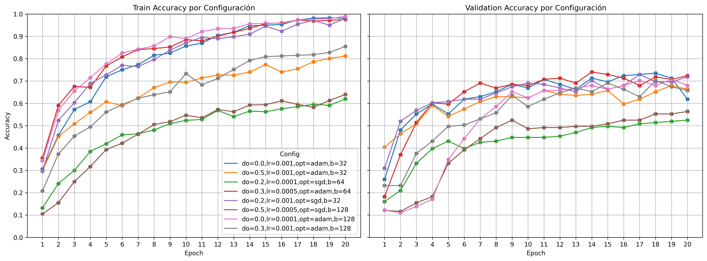
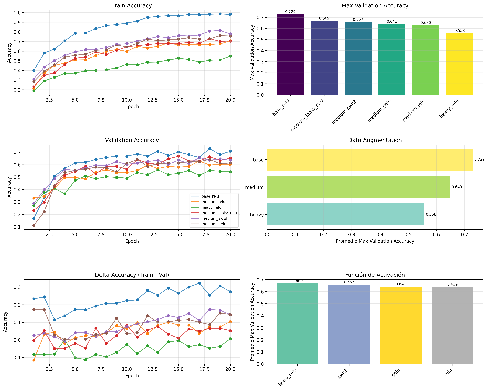
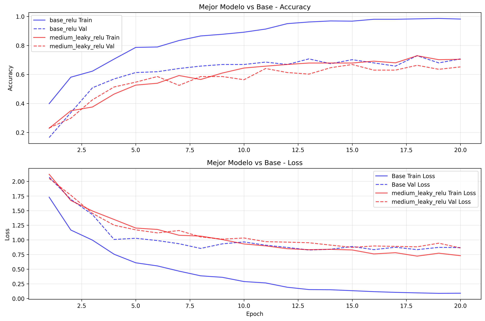

## Análisis de Clasificación con CNN y Búsqueda de Hiperparámetros

***Nota:** Se renombró `Clasificacion.ipynb` a `Clasificacion_MLP.ipynb` y se experimentó con CNN en `Clasificacion_CNN.ipynb` para que quede más ordenado el proyecto.*

---

Para mejorar el rendimiento y aumentar la capacidad del modelo, se agregaron más capas convolucionales y se aumentaron los filtros (canales de salida). También se usaron capas `BatchNorm2d` luego de cada convolución para ayudar a estabilizar y acelerar el entrenamiento. En principio se probaron varias configuraciones variando `lr`, `dropout`, `optimizer` y `batch_size`. Luego se usaron otras funciones de activación para tratar de evitar la muerte de neuronas y poder mejorar la convergencia.

Algunas observaciones de los resultados:

- **Dropout** chico puede mejorar el accuracy pero también generar un mayor sobreajuste.
- **Adam** suele converger más rápido que SGD.
- **Learning rate 1e-3** funciona bien para la mayoría de los casos; 1e-4 puede necesitar más épocas pero suele dar mejores resultados.
- **Batch size 64** permite mayor estabilidad si hay memoria suficiente.

Con la mejor configuración base encontrada (**dropout=0.3, lr=0.0005, optimizer=adam, batch_size=64**), se ensayaron algunas modificaciones:

**Data Augmentation**

- Base: Solo resize y normalización
- Medium: + rotación + color jitter
- Heavy: + múltiples transformaciones avanzadas

**Funciones de Activación**

- ReLU: Función estándar
- Leaky ReLU: Permite gradientes negativos pequeños
- Swish/SiLU: Función suave y diferenciable
- GELU: Usada en transformers modernos

Se realizaron entrenamientos de **20 epochs** con learning rate scheduling y métricas accuracy y loss. También se hizo un análisis comparativo y se agregaron visualizaciones de resultados.

Se puede ver que en general las modificaciones no mejoraron los resultados. Mirando más en detalle, por más que el modelo base tiene mayores accuracies, existe una gran diferecia entre train y validación, indicando overfitting. Los modelos con menor diferencia son `heavy_relu` y `medium_leaky_relu`, por lo que aluden a ser los que mejor generalizan, aunque hay que considerar que su accuracy no fue tan alto. De todas formas, estos son tan solo un par de parámetros útiles para comparar modelos, es necesario observar un panorama más amplio si se desea elegir el mejor posible, dado que cada uno tiene sus beneficios. Tal vez incluso no hubiera convenido seleccionar el modelo base que se consideró como mejor, porque mirando hacia atras se puede ver que también presentaba overfitting (y había un par de opciones mejores en este sentido).

En varios casos la CNN obtiene mejores resultados generales que MLP. Puede tener menor cantidad de parámetros y tiene capacidad para capturar patrones espaciales en las imágenes. Aun así, se llega a la conclusión de que es conveniente mantener un dropout moderado en redes pequeñas, además de evaluar con un subconjunto del dataset para seleccionar buenas combinaciones antes de escalar.

---
